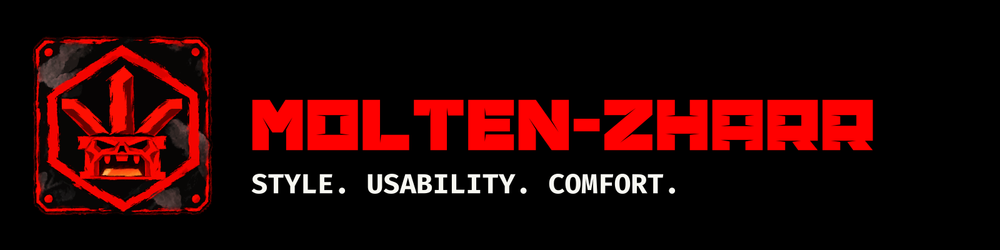
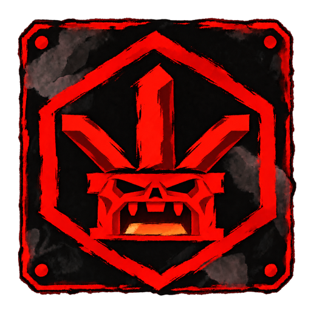

<!-- Разместите содержимое этой папки в корне публичного репозитория iamadahn/iamadahn. -->



[English](README.md) · [Русский](README.ru.md)



# Adahn The Imagined

Пишу встраиваемое ПО на C и Rust для STM32 и ESP32.

Разработчик [Molten-Zharr](https://github.com/molten-zharr).

<p>
  <a href="https://github.com/iamadahn"></a>
  <a href="https://github.com/molten-zharr"></a>
  <a href="manifesto/README.ru.md"></a>
</p>

```text
languages  C - Rust
platforms  STM32 - ESP32 - Zephyr RTOS
focus      Встраиваемые системы - удобство
```

<br clear="right">


## Что для меня важно

<p>
  
  
  
</p>

Я разделяю подход Molten-Zharr: красивое ПО, помощь внутри программы и полноценное управление мышью и клавиатурой - вместе или по отдельности.

[Наш манифест](manifesto/README.ru.md).

## Проекты

| Проект | Что он делает |
|---|---|
| [iamforecast](https://github.com/iamadahn/iamforecast) | Метеостанция на ESP32 и Zephyr RTOS с дисплеем, сенсорным вводом и датчиком температуры и влажности. |
| [iamrc](https://github.com/iamadahn/iamrc) | Прошивка на Rust для пульта управления iamcar на STM32F411. |
| [stm32iamboot](https://github.com/iamadahn/stm32iamboot) | Загрузчик для STM32F1 с обновлением прошивки через USART. |

<details>
<summary>Подробнее о моих инструментах</summary>

- **STM32:** прошивки для микроконтроллеров и загрузчики.
- **ESP32 и Zephyr RTOS:** платформа метеостанции iamforecast.
- **C и Rust:** языки моих проектов для микроконтроллеров.

</details>
